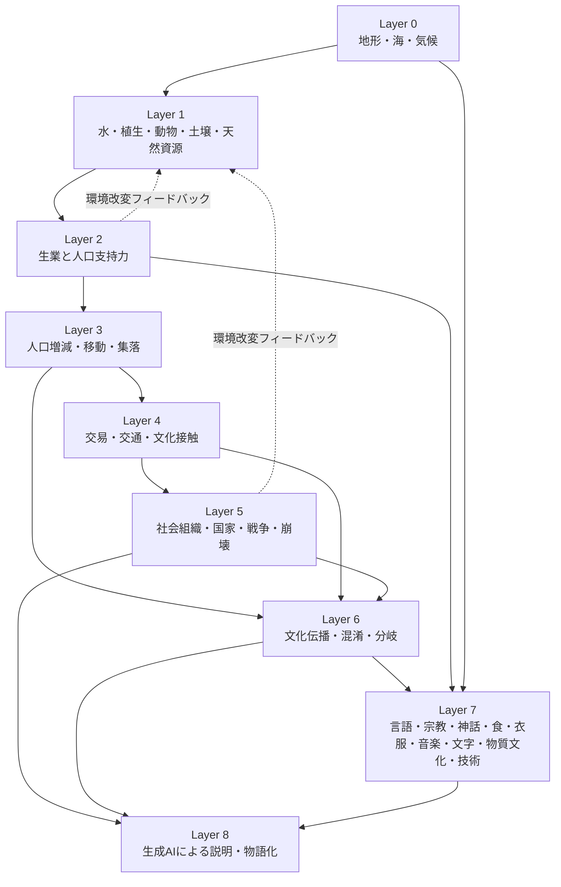

# 文明シミュレーター独自設計案（Pass 7・最重要成果物）

本ファイルは、Pass 1〜6の先行実装調査を踏まえた**このプロジェクト独自の設計提案**である。既存10プロジェクトの寄せ集めではなく、「現実の人類学・考古学・文化データを利用しながら、任意の地形・気候から『ありそうな別の人類史』を作る」ことを中心に据える。

**本ファイルはコードを一切含まない。実装方針の議論であり、実装そのものではない。**

---

## 0. 設計思想の3行要約

1. 文明・集団に「性格」「タイプ」という固定的な内心パラメータを持たせず、行動傾向は「地形・気候・資源・人口履歴・接触史・偶然」という環境的・履歴的要因から確率的に立ち現れるものとして扱う。
2. 「条件Xなら必ず結果Y」という一対一決定論をすべての層で避け、「条件Xなら結果Yの確率が高いが、Z・Wもありうる」という確率分布に基づき、同じ世界条件でもseedを変えると複数のもっともらしい歴史が生まれるようにする。
3. LLMは数値・確率モデルが確定した世界状態を解釈・命名・物語化する役割に限定し、数値化が難しい文化領域でのみ「候補生成器」として使い、その出力は確率的な制約条件でフィルタしてから採用する（AEONの設計よりさらに保守的な境界）。

---

## 1. Layer構成の全体像

**重要な設計判断**: Layer 6（文化伝播・混淆・分岐）はLayer 3・4・5すべてから入力を受ける横断的な層として配置する（単純な直列パイプラインにしない）。これはPass 4で確認した通り、文化伝播が「人口移動」「交易接触」「政治的統合」という複数の経路から同時並行的に駆動されるため。またLayer 5（社会・国家）とLayer 2（生業）からLayer 1（生態系）への環境改変フィードバック（MayaSim型の崩壊メカニズム）を明示的に持たせる。

---

## 2. Layer別詳細

### Layer 0: 地形・海・気候

- **入力データ**: 惑星パラメータ（半径、自転周期、公転周期、恒星距離、地軸傾斜、大陸配置seed）。**既存アプリの地形・気候システムが担当する領域であり、本調査では変更しない**。
- **状態変数**: 標高、海陸区分、気圧場、風、海流、気温（季節）、降水（季節）、Köppen/Whittaker等のbiome分類。
- **他Layerへの出力**: biome分布、河川網、海岸線、標高、季節気候パターン → Layer 1へ。
- **最小実装**: 現行アプリの気候モデル（既存）。
- **追加可能な高度化**: World Orogenの実Earthデータへの自動チューニングループ（Köppen適合度でパラメータ最適化）を、既存の気候モデルの「壁」を越えるための短期施策として検討する価値がある（ただし本調査の対象外であり、既存アプリを変更しないという今回の制約の外側）。
- **実データによる校正方法**: 実Earth地形を入力し、生成されたKöppen区分と観測Köppen区分の適合度をスコアリング（World Orogen方式）。
- **計算負荷**: 中〜高（一度きりの世界生成時のみ）。
- **Pixel 7aで実時間処理すべきか**: 生成時のみなら許容範囲。季節ごとの再計算が必要な場合は事前計算が望ましい。
- **クラウド事前計算すべきか**: 惑星生成自体は端末上で許容範囲だが、実Earthデータとの照合を伴う自動チューニング（パラメータ最適化ループ）はクラウドで一度実施し、結果のパラメータセットのみ端末に持たせるのが妥当。

### Layer 1: 水・植生・動物・土壌・天然資源

- **入力データ**: Layer 0の出力（biome、河川、標高、気候）。
- **状態変数**: セルごとの植生タイプ・NPP（純一次生産量）、動物相の存在確率分布、土壌タイプ・肥沃度、鉱物・水資源の分布。
- **他Layerへの出力**: 資源ポテンシャル（食料源・水・鉱物・建材）→ Layer 2へ。
- **最小実装**: MayaSim型のNPP式（`NPP = min(降水関数, 気温関数)`）＋biomeごとの基準資源値テーブル。
- **追加可能な高度化**: Oikoumene型の複数資源レイヤー（食料・鉱物・淡水・化石燃料相当のエネルギー源）を独立変数として持たせ、断層帯・堆積盆地等の地質学的构造から鉱物の空間的偏在を生成する。動物相を「利用可能な狩猟対象種」として気候・biomeから確率的に生成する（一種のプロシージャル動物相）。
- **実データによる校正方法**: 実在するbiome別の生産性の統計値（FAO GAEZ的なデータ、Oikoumeneが参照）を基準レンジとして使う。
- **計算負荷**: 中（Layer 0の出力から一括計算可能、静的レイヤー）。
- **Pixel 7aで実時間処理すべきか**: 生成時のみなら可能。
- **クラウド事前計算すべきか**: 惑星生成の一部として事前計算し、以降は静的データとして扱うのが妥当。

### Layer 2: 生業と人口支持力

- **入力データ**: Layer 1の資源分布、集団の技術水準（Layer 7からのフィードバック）。
- **状態変数**: 各集団の生業選択（狩猟採集・漁撈・牧畜・農耕、または混合）の確率分布、期待収量、労働投入、リスク（不作確率）、人口収容力。
- **他Layerへの出力**: 人口収容力の上限値 → Layer 3へ。
- **最小実装**: biomeごとに複数生業の期待収量テーブルを持ち、収量が最大の生業を選択する簡易版から開始し、初期段階から「収量に応じた確率的選択（softmax）」にしておく（後から決定論を確率化するより、最初から確率的にしておく方が設計変更コストが低い）。
- **追加可能な高度化**: MayaSim型のBCA（便益コスト分析）を複数生業に拡張。技術水準（灌漑・冶金等）による生業転換の解禁。集団の文化的記憶による生業選択の慣性（Layer 6との相互作用）。
- **実データによる校正方法**: D-PLACE等の民族誌データベース（ユーザーが既に調査中とのこと）から、同様の環境条件下での実際の生業分布の統計を教師データとして使う。
- **計算負荷**: 低〜中（集団単位の計算、セル単位ではない）。
- **Pixel 7aで実時間処理すべきか**: 可能（集団数は地形セル数よりずっと少ない）。
- **クラウド事前計算すべきか**: 不要。実時間で十分。

### Layer 3: 人口増減・移動・集落

- **入力データ**: Layer 2の人口収容力、Layer 1の地形移動抵抗、Layer 4の交易・接触情報。
- **状態変数**: 集団ごとの人口、出生率・死亡率、移住圧力、移住先候補とその確率分布、集落の位置・規模・ライフサイクル状態。
- **他Layerへの出力**: 集落の分布・規模 → Layer 4・5へ。移住による集団の混合履歴 → Layer 6へ。
- **最小実装**: ロジスティック人口成長＋Genesis型の効用スコアリングによる移住先選択（ただし決定論的最大化ではなく確率的重み付き選択に変更）。
- **追加可能な高度化**: プッシュ要因とプル要因の分離、既知の同族集団への優先移動（chain migration）、情報の不完全性（遠方の土地の実態を知らずに伝聞で移動）、地形障壁（NeoNet型の峡谷・山脈等の明示的モデル化）。
- **実データによる校正方法**: 本ファイル末尾「校正のための教師データ候補」参照（Out of Africa経路、沿岸移住、河川流域集中等）。
- **計算負荷**: 中（集団数×候補地探索範囲）。
- **Pixel 7aで実時間処理すべきか**: 集団数が数百〜数千規模なら可能。エージェント個体レベル（Oikoumeneのような数千個体）まで踏み込むと厳しい。
- **クラウド事前計算すべきか**: 「1回のシミュレーション実行」自体はリアルタイム性が求められないバッチ処理と割り切り、クラウドで実行して結果（歴史ログ）を端末に配信する構成が現実的（Genesisの「10,000年を3-5秒」という速度感を目安に、集団ベースのマクロモデルに留める限りは端末実行も視野に入る）。

### Layer 4: 交易・交通・文化接触

- **入力データ**: Layer 3の集落分布、Layer 0の地形（山脈・海峡等の移動障壁/回廊）。
- **状態変数**: 集落間の交易ネットワーク（重み付きグラフ）、接触頻度、交易品の種類・流量。
- **他Layerへの出力**: 接触頻度・交易関係 → Layer 5（国家間関係）・Layer 6（文化伝播経路）へ。
- **最小実装**: MayaSim型のランクベース交易リンク（人口上位の集落同士を距離順に接続）。
- **追加可能な高度化**: 重力モデル（Oikoumene型）、Delaunay+最長辺除去による交易路骨格の生成（Azgaar型、道路網としてではなく交易路として独自に再設計）、交易品の需給差モデリング。
- **実データによる校正方法**: 既知の古代交易路（シルクロード、琥珀の道等）の存在した地理的条件（山脈の隘路、河川、海峡）を教師データとして、生成された交易網が同様の地形的必然性を再現するか検証する。
- **計算負荷**: 中（集落数の2乗に近いオーダーだが、距離制約で枝刈り可能）。
- **Pixel 7aで実時間処理すべきか**: 集落数が数百規模なら可能。
- **クラウド事前計算すべきか**: Layer 3と合わせてバッチ処理が妥当。

### Layer 5: 社会組織・国家・戦争・崩壊

- **入力データ**: Layer 3の集落・人口、Layer 4の交易・接触関係。
- **状態変数**: 統治形態（連続的な中央集権度スペクトラムから確率的に導出）、対集団関係値、紛争確率、領土、安定度。
- **他Layerへの出力**: 政治的統合・分裂の履歴 → Layer 6へ。環境改変（資源採取圧力）→ Layer 1へフィードバック。
- **最小実装**: Oikoumene型のロジスティック回帰による紛争確率（資源競合・パワーパリティ・交易依存・社会的緊張・領土隣接・同盟・外交履歴の加重合成）。国家形成はOikoumene型の有機的な集落合体（閾値人口での創発）。
- **追加可能な高度化**: MayaSim型の環境劣化→社会的緊張→崩壊のフィードバックループ。Genesis型の内戦分裂・帝国宣言の閾値判定（確率化した上で）。AEON型の派閥による革命。
- **実データによる校正方法**: 紛争発生率はUCDP/PRIO等の実データ分布（Oikoumeneが参照）でキャリブレーション可能。崩壊パターンはSeshatデータベース（ユーザーが既に調査中）の実例と定性的に比較。
- **計算負荷**: 中（集団・国家数のペアワイズ計算）。
- **Pixel 7aで実時間処理すべきか**: 国家数が数十〜百規模なら可能。
- **クラウド事前計算すべきか**: Layer 3・4と合わせたバッチシミュレーションの一部として扱う。

### Layer 6: 文化伝播・混淆・分岐

- **入力データ**: Layer 3の移住履歴、Layer 4の接触頻度、Layer 5の政治的統合・分裂履歴。
- **状態変数**: 集団ごとの文化形質ベクトル（言語・宗教・技術・食文化等、複数の独立した形質軸）、各形質の同調バイアス強度・同類性強度（Mesoudiモデルのa, rパラメータ）。
- **他Layerへの出力**: 文化的近縁性・分岐度 → Layer 7へ。
- **最小実装**: **Mesoudiモデルをそのまま最小実装として採用**——移住が発生しても、同調バイアス（多数派形質の重み付け）と同類性（似た者同士の学習）の2パラメータだけで、集団間文化差（Fst指標）が持続することを保証する。これが今回のアプリの「移住しても文化が即座に混ざらない」という要求を満たす最も単純かつ理論的裏付けのある実装。
- **追加可能な高度化**: 文化形質ごとに同調・同類性の強さを変える（言語は保守的、技術は伝播しやすい等）。複数世代にわたる「層状」文化保持（表層は同化、深層信仰は保持）。政治的統合（Layer 5の国家形成）が文化統合を加速する効果、逆に政治的分裂が文化的分岐を加速する効果を明示的にモデル化する。
- **実データによる校正方法**: 言語族の分岐パターン（語彙年代学）、宗教の分布の地理的相関、既知の文化圏境界（山脈・言語境界線と一致するか）を定性的な検証材料とする。
- **計算負荷**: 低〜中（集団数×文化形質数）。
- **Pixel 7aで実時間処理すべきか**: 可能。
- **クラウド事前計算すべきか**: Layer 3〜5と合わせたバッチ処理内で計算。

### Layer 7: 言語・宗教・神話・食・衣服・音楽・文字・物質文化・技術

- **入力データ**: Layer 6の文化形質ベクトルと分岐履歴、Layer 1の利用可能資源（素材プール）、Layer 2の生業。
- **状態変数**: 各文化圏の言語系統・語彙年代学的距離、宗教の教義・儀礼・神話内容、食文化の特徴的な素材・調理法、物質文化（衣服・楽器・文字体系の有無と特徴）、技術水準（DAG上の到達点）。
- **他Layerへの出力**: 「その世界の特定の文化圏の具体的な特徴」というLayer 8（LLM）への入力データ。
- **最小実装**: 各サブ領域（言語・宗教・食・衣服等）について、Layer 1の資源プール＋Layer 2の生業＋Layer 6の文化形質ベクトルから「利用可能な要素の確率的な組み合わせ」を生成する（例: 利用可能な動植物種×加工技術水準→特徴的な食材リストの確率的サンプリング）。技術はGenesis型のDAG＋地理バイアスの加重ランダム選択（性格バイアスは採用しない）。
- **追加可能な高度化**: AEON型の宗教ライフサイクル（創始→伝播→分裂→対立）。神話内容を実際にその集団が経験した環境イベント（大洪水、日食、飢饉等のLayer 0-5のイベントログ）から生成する「経験に基づく神話生成」——ここはLLMの候補生成器としての役割が最も自然に活きる領域。
- **実データによる校正方法**: D-PLACE（既にユーザーが調査中）の民族誌データベースで、類似環境条件下での実際の文化要素の統計分布と比較。
- **計算負荷**: 低（文化圏数×形質数、セル単位ではない）。
- **Pixel 7aで実時間処理すべきか**: 数値・確率部分は可能。LLMによる候補生成を伴う部分はネットワーク呼び出しが必要なため実時間性はLLM APIのレイテンシに依存する。
- **クラウド事前計算すべきか**: 数値モデル部分はバッチ処理内で計算し、LLMによる文章化・候補生成はオンデマンド（ユーザーが特定の文化圏を「見る」時にのみ）で行うのが効率的（AEONのLLM呼び出し設計を参考に、頻度を抑えたレート制限型の呼び出しにする）。

### Layer 8: 生成AIによる説明・物語化

- **入力データ**: Layer 0〜7で確定した全ての数値・イベントログ。
- **状態変数**: なし（LLM出力はキャッシュされる派生データであり、世界の権威ある状態ではない）。
- **他Layerへの出力**: なし（一方向。LLM出力が数値レイヤーへ書き戻ることは基本的に禁止する——AEONの設計よりさらに保守的）。
- **最小実装**: 確定したイベントログ・状態のスナップショットをLLMに渡し、単発の説明文・命名・要約を生成する読み取り専用の機能。
- **追加可能な高度化**: Layer 7の「数値化が難しい文化領域」（神話の具体的な物語内容、装飾のモチーフ等）について、LLMを「候補生成器」として使う。ただし出力は即座に事実として確定せず、「その世界の環境・接触史と整合するか」を確率的な制約条件（例: 存在しない資源をモチーフに含めていないか、接触していない文化の要素を借用していないか）でフィルタしてから採用する、というデータベース＋制約条件＋確率＋LLMの組み合わせ構成にする。
- **実データによる校正方法**: 該当なし（LLMの品質評価は本調査の範囲外）。
- **計算負荷**: LLM API呼び出しコストに依存。
- **Pixel 7aで実時間処理すべきか**: いいえ。LLM呼び出しはネットワーク経由のクラウドAPIとして扱うべきで、端末側での実行は想定しない。
- **クラウド事前計算すべきか**: 主要な文化圏・出来事について事前に物語化しキャッシュしておき、ユーザーが未閲覧の領域を見た際にオンデマンドで生成する、というハイブリッド方式が現実的（AEONのrate-limitedキュー設計を参考に）。

---

## 3. 独自性のための3つの設計原則（`differentiation-risks.md`と対応）

1. **パラメータの所在**: 文明・文化オブジェクトに「性格」「タイプ」という固定的な内心パラメータを持たせない。すべての行動傾向は、Layer 0〜7の環境的・履歴的状態から導出する。
2. **決定論から確率分布へ**: 「条件Xなら必ず結果Y」を避け、「条件Xなら結果Yの確率が高いが、Z・Wもありうる」という設計を全Layerで徹底する。同じ世界条件・異なるseedから複数のもっともらしい歴史が生まれることを、動作確認の基準にする。
3. **LLMは解釈者、代行決定者ではない**: Layer 8はLayer 0〜7の確定状態から一方向にのみ生成し、数値レイヤーへの書き戻しを行わない（AEONより保守的）。文化の具体的内容生成にLLMを使う場合も、データベース＋制約条件＋確率でフィルタしてから採用する。

---

## 4. 校正のための教師データ候補（Sonnetによる提案）

ユーザーが例示した候補について、学術的完全再現ではなく「大筋としてデタラメにならない」水準の校正材料として評価する。

| 候補 | 利用可能性 | 校正対象Layer | 具体的な使い方の提案 |
|---|---|---|---|
| Out of Africa | 高（古気候・遺伝学的推定経路が比較的よく研究されている） | Layer 3（移動先選択） | Oikoumeneが参照するEPICA/Vostok/Marcott等の古気候データを初期条件として与え、生成された移住経路が定性的に東アフリカ→アラビア→アジア/ヨーロッパという既知の大筋から極端に逸脱しないかを確認するテストケースとする。 |
| 新石器農耕拡散 | 高（NeoNetが実際に扱っている領域） | Layer 3, Layer 6 | NeoNet型の放射性炭素年代データによる実際の拡散速度（km/世紀）を教師データとし、Layer 3の移住モデル＋Layer 6の技術伝播モデルから同程度のオーダーの拡散速度が創発するかを検証する。 |
| 海岸沿い移住 | 中〜高 | Layer 3 | 地形移動抵抗（Oikoumene型の`terrain_friction`）で海岸移動が内陸移動よりコストが低くなるよう校正し、生成された移住パターンが海岸沿いに偏るという定性的傾向を確認する。 |
| 河川流域への人口集中 | 高 | Layer 2, Layer 3 | Layer 1の資源分布（水資源・肥沃度）が河川近傍で高くなるよう校正し、Layer 3のシミュレーションで河川流域の人口密度が内陸より高くなるかを確認する。 |
| 交易路（山脈・砂漠・海峡等の障壁） | 中（NeoNetの障壁モデリングは未完成という反面教師あり） | Layer 4 | 既知の古代交易路（例: 隘路・峠道）の地理的条件を教師とし、Layer 4の交易ネットワーク生成が同様の地形的必然性（山脈を避ける、河川沿いに伸びる）を再現するかを確認する。 |
| 技術・作物・宗教・言語等の拡散 | 中〜高（作物・技術はNeoNet/考古学データ、言語はより間接的） | Layer 6, Layer 7 | 既知の伝播速度（新石器化の速度等）を基準レンジとし、Layer 6の文化伝播モデルが桁違いに速い/遅い拡散を生成しないかを確認する。 |

**重要な留保**: これらはいずれも「学術的な完全再現のテスト」ではなく、「生成結果が定性的に非常識でないか」を確認するための**リアルっぽさの校正テストセット**として位置づける。ユーザーの方針（学術的厳密性より創作的説得力を重視）と一致させている。

---

## 5. 計算配置戦略（総括表）

| Layer | Pixel 7a実時間処理 | クラウド事前計算/バッチ | 備考 |
|---|---|---|---|
| 0 地形・気候 | 生成時のみ許容 | 実データ校正の自動チューニングはクラウド推奨 | 既存アプリの範囲外 |
| 1 資源 | 許容 | 惑星生成の一部として事前計算 | 静的レイヤー |
| 2 生業 | 許容 | 不要 | 集団単位の軽量計算 |
| 3 人口・移動・集落 | 集団規模次第で許容 | 長期シミュレーション本体はバッチ推奨 | Genesis型の高速マクロモデルを目安に |
| 4 交易 | 許容 | Layer 3と合わせてバッチ | 距離制約で枝刈り可能 |
| 5 社会・国家・戦争 | 許容 | Layer 3・4と合わせてバッチ | ペアワイズ計算 |
| 6 文化伝播・混淆 | 許容 | Layer 3〜5と合わせてバッチ | 軽量 |
| 7 言語・宗教等 | 数値部分は許容、LLM部分は不可 | 数値はバッチ、LLM候補生成はオンデマンド | ハイブリッド |
| 8 LLM物語化 | 不可（ネットワーク依存） | 主要イベントは事前生成キャッシュ、詳細はオンデマンド | レート制限必須 |

**総括方針**: Layer 0〜6の数値・確率モデルは「1回のシミュレーション実行」をクラウドでバッチ処理し、確定した歴史ログ（randyau/worldgen型のイベントログ構造を参考）を端末に配信する構成が最も現実的。端末側はそのログを閲覧・検索し、必要に応じてLayer 8のLLM物語化をオンデマンド呼び出しする、というクライアント/サーバー分離が妥当と考えられる。

---

## 6. 本調査を踏まえた次の検討ステップ（実装ではなく、次に何を決めるべきかの提言）

本調査は「調査」のみを目的としており、以下は実装ではなく**今後ユーザーが判断すべき論点**の提示に留める。

1. Layer 6（文化形質の同調・同類性パラメータ）の初期値を、D-PLACE等の実データからどう推定するか——本調査では原理のみ確認しており、実データとの具体的な対応付けは未検討。
2. Layer 8のLLM候補生成における「制約条件フィルタ」の具体的な設計（何を「整合しない」と判定する基準にするか）は、本調査の範囲外であり別途の設計検討が必要。
3. 既存アプリの気候モデルの「壁」に対し、World Orogenの自動チューニングループ（実Earth Köppenデータとの適合度評価）という方法論を採用するかどうかは、ユーザーの判断を要する（本調査は原理の指摘に留め、既存コードには一切手を加えていない）。
4. Seshat・D-PLACE・eHRAF等の実データベースとの接続構想は、ユーザーが既に別途調査中とのことなので、本調査（Layer 2・5・7の校正提案）との接続点を今後すり合わせる必要がある。
